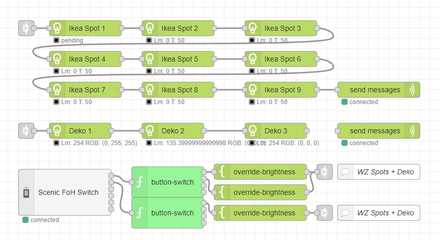

  

# Zigbee2MQTT Nodes for Node-RED

This project contains Node-RED nodes that allow you to build Smart Home scenarios with your Zigbee devices connected to [ZigBee2MQTT](https://www.zigbee2mqtt.io/).

## Available Nodes

Many nodes are available right now, and there are still new node ideas that will be added in the near future. Here is a list of the currently available ones:

- [generic-lamp](docs/nodes/generic-lamp.md)
- [send-messages](docs/nodes/send-messages.md)
- [override-nodes](docs/nodes/override-nodes.md)
- [button-switch](docs/nodes/button-switch.md)
- [scene-in](docs/nodes/scene-in.md)
- [scene-selector](docs/nodes/scene-selector.md)
- [ota-node](docs/nodes/ota-node.md)
- [bridge-log](docs/nodes/bridge-log.md)
- And many more for sensors and remotes...

## Getting started

Have a look at [the getting started guide.](docs/getting-started.md). All you need are some already paired Zigbee lamps and an installed Node-RED. What are you waiting for? Find out now how easy it is to get started.

## Documentation

The [documentation](docs/documentation.md) for the project is located in the `docs` folder.

## You need some addition help?

Join the [Discord server](https://discord.gg/4qCMEhJ) for a more in depth support or problems that aren't metioned anywhere :)

## Changelog 

### Release: `0.19.2`

#### Bug fixes:

- Local node-red installation with nodejs 12 had a problem to load the node-red dependency. Removed it for now as it is only used for logging.

### Release: `0.19.1`

#### Bug fixes:

- Better handling for invalid MQTT messages from z2m. Sometimes a required/expected property is missing or empty which caused an error.
- Hue Dimmer switch crashed NodeRED because the power status with no action came with no action.

#### Behind the scenes

- Removed some unnecessary files from the package, reducing the size from 324 kB to 229 kB
- Removed vulnerable dependencies
- Updated and thinned out dependencies so the installation will be faster
- Dev feature: Cleaned up npm build scripts so there are no warnings, and they behave the same on Windows, Linux, and macOS.

### Release: `0.19.0`

#### Features:
- Two new example flows, from the getting started guide
- Documentation overview page
- Documented examples
- Show **switch to manual** button if the device-list request failed.
- Added `deviceName` to the ouput of the climate-sensor. Resolves #75
- Added `separateOuputs` option the the climate sensor. Resolves #75

### Older changelogs

You can find all the release notes at the [Release-Page](https://github.com/Dirnei/node-red-contrib-zigbee2mqtt-devices/releases)

## You want to contribute?

That's easy! Feel free to post suggestions, adding documentation or add new features. Every support is welcome!

If you feel very generous and want to contribute with coffee, you sure can:

[![Buy me a coffee][buymeacoffee-shield]][buymeacoffee]

[buymeacoffee]: https://www.buymeacoffee.com/dirnei
[buymeacoffee-shield]: https://www.buymeacoffee.com/assets/img/custom_images/orange_img.png
