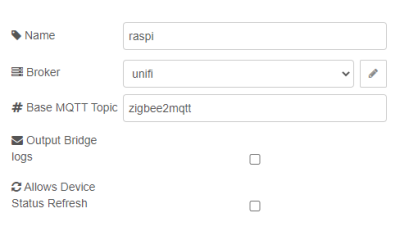
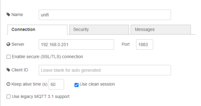
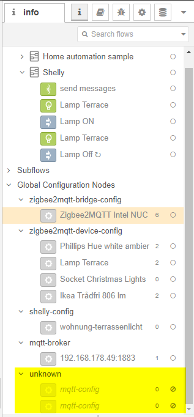

  

# Zigbee2MQTT Nodes for Node-RED

This project contains Node-RED nodes that allow you to build Smart Home scenarios with your Zigbee devices connected to [ZigBee2MQTT](https://www.zigbee2mqtt.io/).

## Available Nodes

Many nodes are available right now, and there are still new node ideas that will be added in the near future. Here is a list of the currently available ones:

- [generic-lamp](docs/nodes/generic-lamp.md)
- [send-messages](docs/nodes/send-messages.md)
- [override-nodes](docs/nodes/override-nodes.md)
- [button-switch](docs/nodes/button-switch.md)
- [scene-in](docs/nodes/scene-in.md)
- [scene-selector](docs/nodes/scene-selector.md)
- [ota-node](docs/nodes/ota-node.md)
- [bridge-log](docs/nodes/bridge-log.md)
- And many more for sensors and remotes...

## Getting started:
Have a look at [this](docs/getting-started.md). All you need are some allready paired Zigbee lamps and a installed Node-RED. What are you waiting for? Find out now, how easy it is to get started.  

## You need some addition help?

Join the [Discord server](https://discord.gg/4qCMEhJ) for a more in depth support or problems that aren't metioned anywhere :)

## Changelog 

### Release: `0.18.1`

#### Features:
- Added the getting started guide to the documentation
- Added a better device-type filter in device-selection for `occupancy`, `climate` and `contact` sensors. Resolves #77

#### Bug fixes:

#### Behind the scenes

- Switched generic sensor nodes to new device-selection (contact, occupancy, climate). Resolves #74
- Removed mqtt-config.ts (file was deleted) reference in package.json that caused a warning in the update-panel

### Release: `0.18.0`

> **IMPORTANT** This release removes the old `mqtt-config`. After you updated this pacakge, you will get many errors but you only need to fix **one** `bridge-config` and all the errors will get away. Sorry for this inconvenience!
>
> Open the `bridge-config` and edit the broker - e.g. in the settings of a `send-messages-node`.
> 
> 
> 
> Reconfigure the MQTT connection. Now everything that uses that bridge uses the new MQTT broker.
> 
> 
> 
> In case you still can't deploy delete the old now unknown `mqtt-config` nodes in the "Global Configuration Nodes" section.
> 
> 

#### Features:

- Removed custom MQTT Configuration and replaced it with the MQTT Configuration from the core nodes
- Added option to `bridge-config` to disable device refresh on deployment
- Added option to `bridge-config` to log log-messages from zigbee2mqtt to the `debug tab`

#### Bug fixes:

- Deployment increased the refresh messages that will be sent on deployment. Fixes #45
- Redone the device-list as payload has changed and this topic is now also retained on the mqtt broker. It should solve #32

### Older changelogs

You can find all the release notes at the [Release-Page](https://github.com/Dirnei/node-red-contrib-zigbee2mqtt-devices/releases)

## You want to contribute?

That's easy! Feel free to post suggestions, adding documentation or add new features. Every support is welcome!

If you feel very generous and want to contribute with coffee, you sure can:

[![Buy me a coffee][buymeacoffee-shield]][buymeacoffee]

[buymeacoffee]: https://www.buymeacoffee.com/dirnei
[buymeacoffee-shield]: https://www.buymeacoffee.com/assets/img/custom_images/orange_img.png
