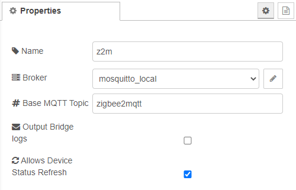

# Bridge configuration

Define the connection to your MQTT-Broker and the base MQTT-Topic, which is defined in the zigbee2mqtt configuration.yaml.



## Broker

Detailed information about the mqtt-config can be found [here](mqtt-config.md)

## Base MQTT Topic

This is defined in your zigbee2mqtt ```configuration.yaml```

Default value is __zigbee2mqtt__

[Back to main](../../README.MD)