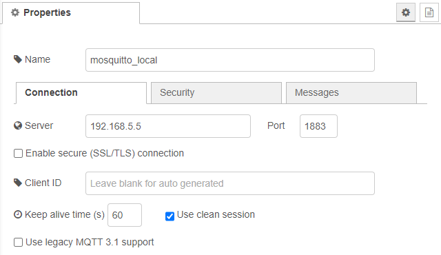

# MQTT configuration

Define the connection to your MQTT-Broker here. It is used in [bridge-config](bridge-config.md) and all other non zigbee2mqtt nodes in this package.

## Protocol

Select your preferred protocol. Possible protocols are: 'mqtt', 'mqtts', 'tcp', 'tls', 'ws', 'wss'. 

## Broker

URL to your MQTT Broker. Example and default value: __localhost__

## Require login

Check this if your connection is secured with username and password. After you enabled this option you have to provide __username__ and __password__

[Back to main](../../README.MD)