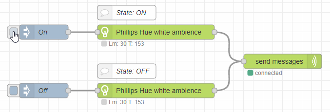
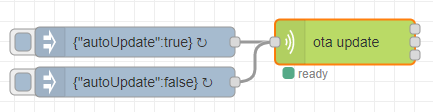
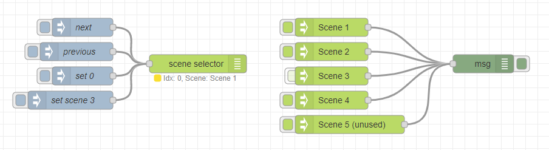

  

# Zigbee2MQTT Nodes for Node-RED Documentation

The Zigbee2MQTT Nodes for Node-REDs allow you to build Smart Home scenarios with your Zigbee
devices connected to [ZigBee2MQTT](https://www.zigbee2mqtt.io/).

## 1. Getting started:
The [**Getting started guide**](getting-started.md) contains an
exemplary tutorial on setting up Node-RED, Zigbee2MQTT, etc., and how to define your first flow
with the Zigbee2MQTT nodes for Node-RED. The guide will give you some examples of how to use the
nodes and insight into the inner workings of the messages the library uses.

If you already paired Zigbee lamps and an installed Node-RED, you can directly skip to the
[Getting started guide: define your first flow](getting-started.md#define-your-first-flow)
section.

## 2. Node documentation

### 2.1 Documentation per node

- [generic-lamp](nodes/generic-lamp.md) Used to define which lamps you want to control.
- [send-messages](nodes/send-messages.md) Prepares and sends the mqtt messages to the MQTT-Broker.
- [override-nodes](nodes/override-nodes.md) Overrides the properties that are set a generic-lamp.
  - [override-state](nodes/override-state.md) Overrides the `ON`/`OFF` state.
  - [override-brightness](nodes/override-brightness.md) Overrides the brightness of a lamp.
  - [override-temperature](nodes/override-temperature.md) Overrides light temperature of a lamp.
  - [override-color](nodes/override-color.md) Overrides the light color of a lamp.
  - [override-action](nodes/override-action.md) Modify brightness/color over time or in steps.
- [button-switch](nodes/button-switch.md)  Is used after a remote node to redirect the message to a seperate output. 
- [scene-in](nodes/scene-in.md) Configures a scene which can be activated via the scene-selector.
- [scene-selector](nodes/scene-selector.md) Select scenes in a defined order.
- [device-satus](nodes/device-status.md) Retrieve notifications when a device status changes.
- [get-lamp-state](nodes/get-lamp-state.md) Retrieve the current state of a lamp.
- [ota-node](nodes/ota-node.md) Used to start OTA updates.
- [bridge-log](nodes/bridge-log.md) Filter logs of the Zigbee2MQTT bridge.
- [climate-sensor](nodes/climate-sensor.md) Used to get values from a climate sensor.

> Note: There are a few nodes for sensors and remotes that have not been documented in the wiki yet, but you can read about them in the internal help documentation.

### 2.2  Configs
- [bridge-config](config/bridge-config.md) Select your MQTT-Broker and the base MQTT topic used for Zigbee2MQTT.
- [mqtt-config](config/mqtt-config.md) Configuret the connection and credentials a your MQTT-Broker.
- [device-config](config/device-config.md) Configure devices and capabilities to use them with the nodes.

## 3. Examples

The examples are already included, if you installed the package.

Open `Node-RED Menu > Import > Examples > node-red-contrib-zigbee2mqtt-devices` to import the example flows.

### Getting started
[**One lamp On/Off**](../examples/getting-started/one-lamp-on-off.json) is a simple example to turn one lamp on and off with two inject nodes.

 
[**Two lamps override**](../examples/getting-started/two-lamps-override.json) demonstrates how to use override nodes to control multiple lamps.

### One Time Update
[**OTA over night**](../examples/ota/ota_over_night.json) enables the auto update between 00:00 and 04:00.

### Scenes
[**Basic scenes**](../examples/scenes/basic_scene.json) switches scenes with the scene selector.

