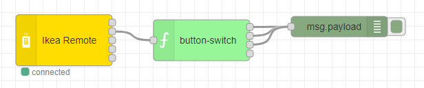
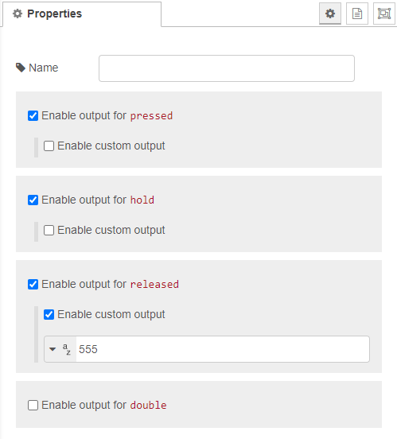

# Button switch

The button switch node is used after a remote node. It redirects the message to it's own seperate output by the ```button_type``` property of the message payload.

The are currently the following ```button_type``` values supported:

- pressed
- hold 
- released
- double (Only the SONOFF touch button supports this type right now)



## Configuration

No configuration needed to use the button switch, but you can define a custom ```msg.payload``` for each ```button_type```. You can input the following types:

- string
- number
- boolean
- json



## Support remote devices

    - Ikea Dimmer
    - Ikea Remote
    - Sonoff Touch Button
    - Scenic Friend of Hue
    - Hue Dimmer switch

### Future implementations

    - Hue Smart button
    - Tint Color remote
    
Or join our [Discord server](https://discord.gg/4qCMEhJ) and suggest a device we should support :) 

[Back to main](../../README.MD)