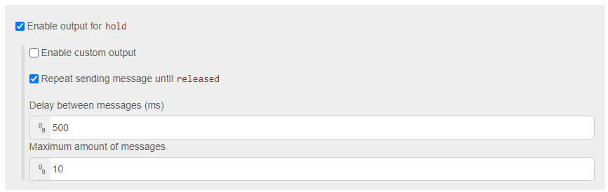

# Button switch

The button switch node is used after a remote node. It redirects the message to it's own seperate output by the ```button_type``` property of the message payload.

The are currently the following ```button_type``` values supported:

- pressed
- hold 
- released
- double (Only the SONOFF touch button supports this type right now)


## Configuration

To use the button switch, you have to enable the outputs you need. You also can define a custom ```msg.payload``` for each ```button_type```. You can define the following types:

- string
- number
- boolean
- json


## Repeatedly send hold message

In some cases, you may want to send multiple messages while a button is held down. If that is the case, you can enable it after you enabled the output for ```hold```. The ```released``` output has not to be enabled for this to work.

> To not end up in an endless loop, you have to specify a ```maximum amount of messages```! If your amount is 0 or less, it will not produce any output!




## Support remote devices

    - Ikea Dimmer
    - Ikea Remote
    - Sonoff Touch Button
    - Scenic Friend of Hue
    - Hue Dimmer switch

### Future implementations

    - Hue Smart button
    - Tint Color remote
    
Or join our [Discord server](https://discord.gg/4qCMEhJ) and suggest a device we should support :) 

[Back to main](../../README.MD)