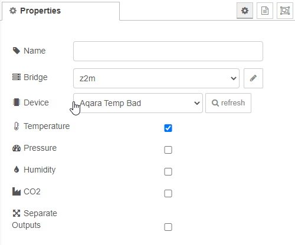

# Climate sensor

The climate sensor node can be used to retrieve data from a climate sensor. In the configuration you can define which values you want to display in the status of the node. If **separate outputs** option is enabled, the selected properties get there own output which only ouputs the value of the property.

## Configuration

### Bridge

For more information see [bridge-config](../config/bridge-config.md).

### Device

Select the zigbee2mqtt device you want to listen to.

### Temperature

Displays the temperature in the status of the node.

### Pressure

Displays the pressure in the status of the node.

### Humidity

Displays the humidity in the status of the node.

### CO2

Displays the CO2 in the status of the node.

### Separate outputs

Separates the selected properties into different outputs. If this is enabled, the first output still outputs the raw MQTT message.

[*← back to the index*](../documentation.md)