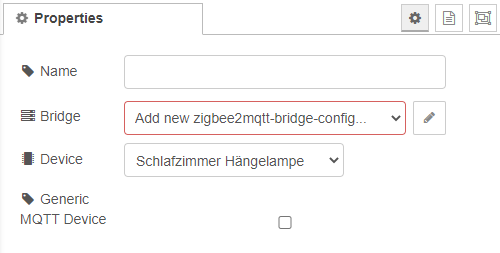
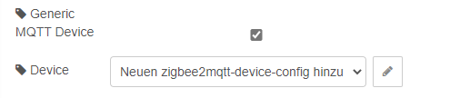

# Device Status

A device status node can be used to retrieve notifications whenever a device status was updated. In the configuration, you can define and select your device which you want to listen to. Note that only zigbee router devices can be selected.

## Configuration

### Bridge

For more information see [bridge-config](../config/bridge-config.md).

### Device

Select the zigbee2mqtt device you want to listen to.

### Generic MQTT Device (experimental)

When checking the checkbox, experimental mode is activated. For further information, see [device-config](../config/device-config.md).

[*← back to the index*](../documentation.md)