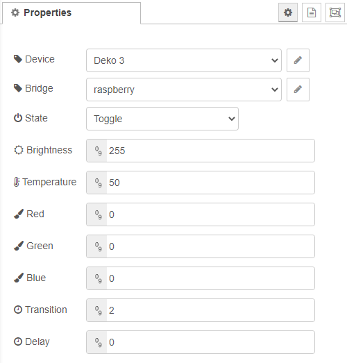

# Generic lamp

A genric lamp is used to define which lamps you want to control. In the configuration you can define and select your device and set all states that the devices supports. When you done setting your state you have to put a [send-messages](send-messages.md) node at the end.

# Configuration

## Device

For more information see [device-config](../config/device-config.md)

## Bridge

For more information see [bridge-config](../config/bridge-config.md)

## State

Set the desired state you want to send to the lamp. Following values are available:

    - ON
    - OFF
    - TOGGLE

## Delay

The delay is used to delay the message befor it will be sent to the mqtt broker. This can be used for animation. It is defined in milliseconds. The order of your lamps withing the flow is important.

[Back to main](../../README.MD)