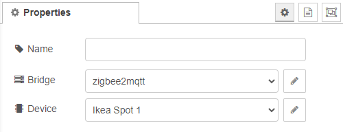

# Device Status

A get lamp state node can be used to retrieve the current state of a lamp (which was configured as [device-config](../config/device-config.md) previously) on message input. In the configuration, you can define and select your device which you want to listen to.

## Configuration

### Bridge

For more information see [bridge-config](../config/bridge-config.md).

### Device

Select the lamp you want to retrieve the state from. For more information see [device-config](../config/device-config.md).

[Back to main](../../README.MD)