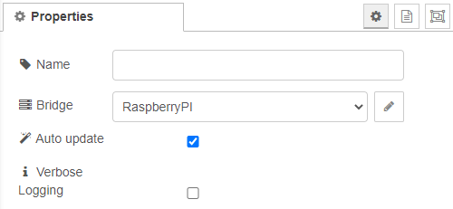
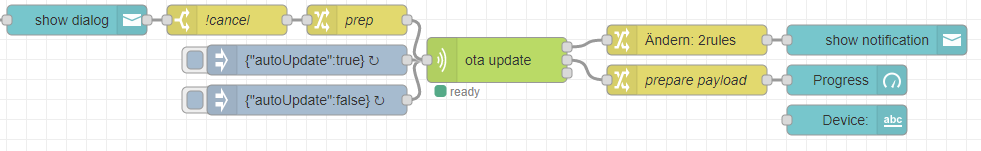
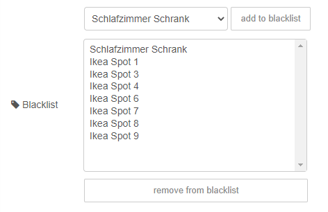
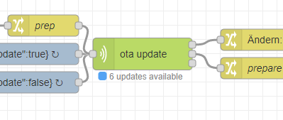
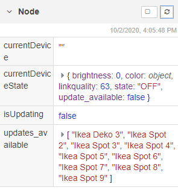
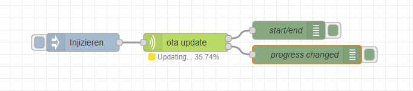
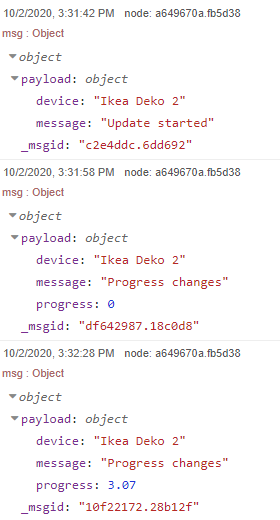
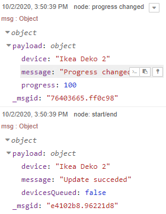

# OTA node

For basic information about OTA updates via zigbee2mqtt, look at the documentation [here](https://www.zigbee2mqtt.io/information/ota_updates.html).

> If you use our dashboard, have a look at the end of the flow. The node is used there to auto-update overnight.

The OTA-node is used to start OTA updates. The updates can be executed manually or automatically. 

## Outputs

This node has three outputs. **start/end**, **progress** and **queue changed**. The name of the output matches the trigger of the message. E.g., when the progress of the current update changes, a message will be sent to output 2 (Label: "progress")

## Manual update

To start the update process manually, you have to send a ```msg``` to the input of the node with the following structure:

``` js
{
    payload: {
        device: "friendly_name"
    }
}
```

## Automatic update

### Always on

If you want the feature always available, you can turn it on in the config.



### Turn on by message

It is also possible to turn this feature **on** and **off** by sending a message to the input with the following structure:

``` js
{
    payload: {
        autoUpdate: true
    }
}
```

A real-world example would be to allow the auto-update only during the night. To archive this, you could use two **inject nodes** to send a message at a specific time — one to turn the auto-update on, one to turn it off.

You can copy-paste the flow example below from the example folder in the repo.



## Blacklist

You may want to update some lamps only manually for various reasons. For example, the Ikea lamps turn on for a short time after the installation process succeeded. If this lamp is over your head while you are asleep, it might wake you. To prevent those situations, you can add those lamps to a blacklist. All lamps on the blacklist can only be updated manually with a **msg** sent to the input (see description above), or you use our dashboard you find in the dashboard folder at the root of the repo.



## Some screenshots

### Example 1: "Updates available"



### Example 2: "Node-context from contextview on the sidebar"



### Example 3: "Update in progress"


### Example 4: "Debug output"




## Nice 2 know
> Only one OTA-update node per bridge is allowed. If more than one is deployed, only the first one will work. All others will show an error status.

[Back to main](../../README.MD)