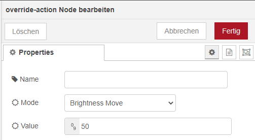

# Override action

Instead of setting a brightness, color_temp, hue or saturation it is also possible to:

__move__ - this will automatically move the value over time, to stop send value 0.

__step__ - this will increment/decrement the current value by the given one.
The direction of move and step can be either up or down, provide a negative value to move/step down, a positive value to move/step up.

### Notes

> brightness move/step will stop at the minimum brightness and won't turn on the light when it's off.

> When a action is set in the current flow, other changes will be ignored. It is only possible to do one action at a time.

[*← back to the index*](../documentation.md)