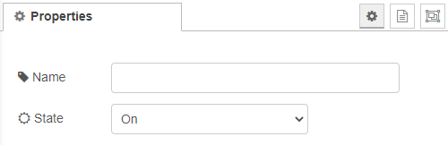

# Override state

The state can be set to ```ON```, ```OFF``` or ```TOGGLE```. Becarefull with ```TOGGLE``` because when not all Lamps in your flow are not in the same state, the ones that are on turn off and vice versa. 



[Back to main](../../README.MD)