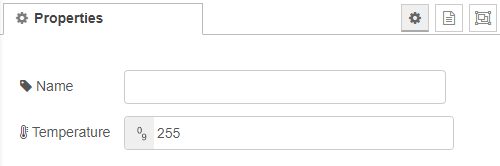
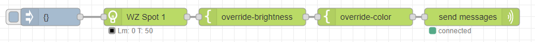

# Override temperature

Used to set the color temperature for all lamps in the flow to the same value. 



Color temperature in Reciprocal MegaKelvin, a.k.a. Mirek scale.

```
 Mirek = 1,000,000 / Color Temperature in Kelvin
```

> Values typically between 50 and 400. The higher the value, the warmer the color.

## Example flow



[*← back to the index*](../documentation.md)