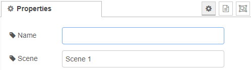

# Scene

A scene-in node configures a scene which can be activated via the [scene-selector](scene-selector.md).

## Configuration



### Name

Changes the display label of the node.

### Scene

The name of the scene which can be used within the [scene-selector](scene-selector.md)s ```set``` command.

[Back to main](../../README.MD)