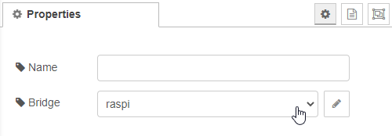

# Send messages

A send message node is need at the and of a flow that should control zigbee2mqtt devices.
It prepares and sends the mqtt messages to the MQTT-Broker.

## Configuration

There is not much configuration needed for this node. Just select or configure a new [bridge configuration](../config/bridge-config.md)

If you want to change the label of the node on flow you can set a name.

[Back to main](../../README.md)