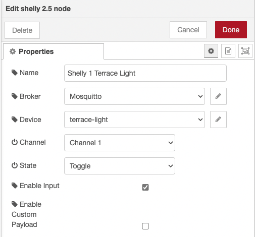

# Shelly 2.5

The shelly 2.5 node controls the relays on a shelly and receives input, relay, and status changes.

Tested with the following Shellies:
- Shelly 1
- Shelly 2.5

## Configuration

### Broker

For more information see [mqtt-config](../config/mqtt-config.md)

### Device

The device section configures a shelly's MQTT topic and, optionally, its friendly name.
For example, `shellies/my-device`, the shelly node will subscribe and publish on this topic.

### Channel

The channel configures which relay will be triggered when the node receives an input. Furthermore, the node only publishes relay and input changes for the selected input.
Possible options are:
- `Channel 1`: Switches and subscribes to channel 1 (MQTT topic `relay/0` and `input/0`).
- `Channel 2`: Switches and subscribes to channel 2 (MQTT topic `relay/1` and `input/1`).
- `Both`: Switches and subscribes to channels 1 and 2.

For the shelly 1, one should stick to channel one, as it has only one input and relay.

### State
The state is used to control the relay when the node receives an input.
- `On`: Switches the relay for the selected channel to on.
- `Off`: Switches the relay for the selected channel to off.
- `Toggle`: Switches the relay for the selected channel on if it is off and vice versa.

### Enable Input
This option enables the input connector on the node. Only when it is enabled is it possible to switch the relays.

### Custom payload
The custom payload allows you to define a specific payload to be published when the shelly's input state changes since the default are `0` and `1`, which might not be too helpful, primarily if two channels are used. For example:
- Payload 1: Input one was triggered
- Payload 2: Input zero was triggered

## Usage

### Control a shelly's relay

On input, the shelly 2.5 node prepares a payload sent to the shelly by [send-messages](send-messages.md) via MQTT.

The inject node triggers the shelly node to create a payload. The shelly node is configured to toggle its state between on and off. Moreover, only channel one is selected. The send-messages node is configured to use an MQTT broker as well as a zigbee2mqtt topic. The zigbee2mqtt topic is ignored for shellies, and they publish at the configured topic, usually `shellies/my-device`.

To try it, have a look at the example: [shelly25-toggle-relay.json](../../examples/shelly-25/shelly25-toggle-relay.json)

### Receive input or relay changes from a shelly

When the relay actuates, or a payload is sent to the first output to the 'Log shelly relay' debug node.
When the input changes, a payload is sent to the second output to the 'Log shelly input' debug node.

To try it, have a look at the example: [shelly25-listen-to-input.json](../../examples/shelly-25/shelly25-listen-to-input.json)

[*← back to the index*](../documentation.md)
